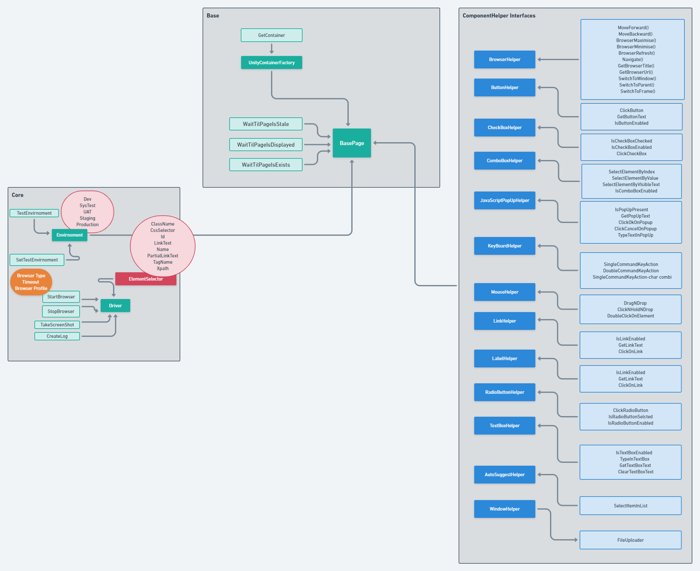

# Automation.Framework

This framework is built on top of selenium webdriver api and unity. The framework uses selenium to offer helper methods which can control various web form elements. 

Please see example project for the implementation of helper methods. 

above project is also available as nuget package : https://www.nuget.org/packages/Automation.Framework/

Unity is responsible for creating and resolving the page objects. This mitigates the need for passing around page objects in methods to 
carry an operation. Please see the example project -> hooks & Page Class to see the implementation. 

To Register Page-

            UnityContainerFactory.GetContainer().RegisterType<PageName>(new ContainerControlledLifetimeManager());
            
To register Driver Instance-

            UnityContainerFactory.GetContainer().RegisterInstance<IWebDriver>(Driver.Browser);

-Serilog is used to create test logs. Please see the example project -> Hooks for implementation. 

-SeleniumExtras.WaitHelpers waits for a element for x seconds before it is displayed/exists. This mitigates the need to create implicit waits. Please see exmaple project -> Page Class for implementation. 
To create a WebElement -

        public IWebElement <ElementName> => WaitTillElementDisplayed((Locator_path,Locator_Stratergy_Type, number of seconds to wait for the element); 
In above we can look up for the web element by Id, Css, Name, LinkText, PartialLinkText, Xpath, ClassName and Tag

This Framework can also be used in conjuction with Specflow, Mstest, Nunit, Xunit. Please see the example project for Implementation.
